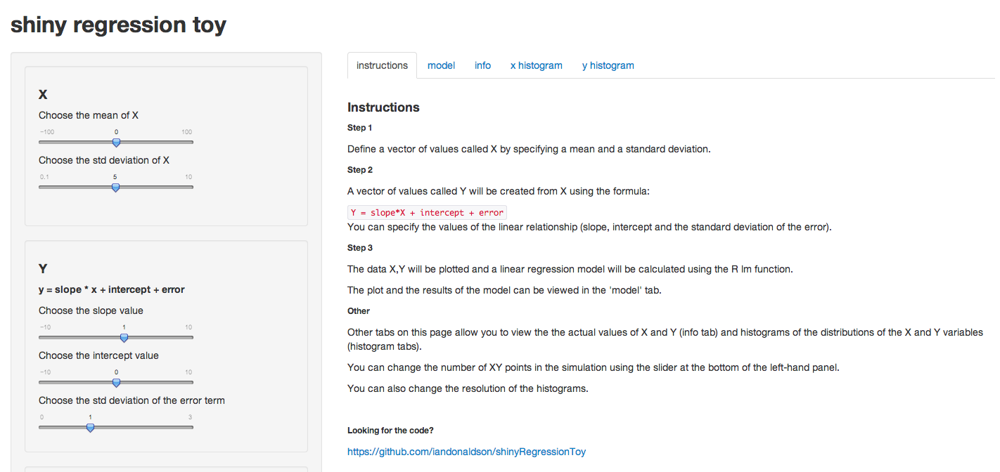
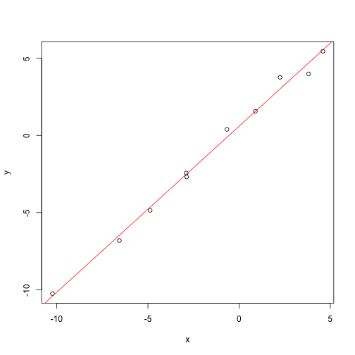

---
title       : Shiny Regression Toy 
subtitle    : A talk powered by slidify and impress.js
author      : Ian Donaldson
job         : Medium-sized data scientist
framework   : impressjs        # {io2012, html5slides, shower, dzslides, impressjs...}
github: {user: iandonaldson, repo: shinyRegressionToy}
twitter: {text: "try shinyRegressionToy"}
highlighter : highlight.js  # {highlight.js, prettify, highlight}
hitheme     : tomorrow     # tomorrow
widgets     : [mathjax]            # {mathjax, quiz, bootstrap}
mode        : selfcontained # {standalone, draft}
knit        : slidify::knit2slides


--- .slide x:0 y:0 scale:2

<q>Shiny Regression Toy</q>
<h1> A talk powered by slidify and impress.js</h1>
<br>
<br>
<h1>Ian Donaldson</h1>
<h6>Medium-sized data scientist

--- #tryit x:2500 y:-500 z:-500  scale:1
<!-- this should be a comment-->
Shiny regression toy is a **toy** application that can help users explore R's linear regression function "lm".
<br>
You can play with it here: [http://iandonaldson.shinyapps.io/shinyRegressionToy/](http://iandonaldson.shinyapps.io/shinyRegressionToy/)
<br>
> * Follow the instructions in the "instructions"" tab
> * Click on the "model" tab to view the results

--- #code x:2500 y:500  z:-500 scale:1

This app was written using shiny and demonstrates the use of tabs and the reactive generation of graphs.
<br>
You can get the code from [github](https://github.com/iandonaldson/shinyRegressionToy)
<br>
Here's a screen shot.  Notice the input panel on the left and the multiple tabs to the right.

--- #screen-shot x:4000 y:0 scale:2



--- #step1 x:0 y:1500 z:0

<b>The guts of the code.</b>  <br>
First, a set of X values is generated using mean and standard deviation input from the user.<br>

--- .slide #step1a x:0 y:2000 z:0

```r
x <- rnorm(n=10, mean=0, sd=5)
x[1:5]
```

```
## [1] -3.7025  2.0737 -0.9527  4.7393 -0.9957
```


--- #step2 x:2000 y:1500 z:0

Second, a set of y values is generated using the x values and the slope and intercept of a linear relation chosen by the user.  Standard deviation of an added error is also specified by the user.

--- .slide #step2a x:2000 y:2000 scale:0.4

```r
slope <- 1
intercept <- 0
error <- rnorm(n=length(x), mean=0, sd=1)
y <- slope * x + intercept + error
y[1:5]
```

```
## [1] -3.512  2.674 -1.031  5.946 -1.025
```


--- #step3 x:4000 y:1500 z:0

Finally, the set of X and Y points are plotted and used as input to the lm function to generate a linear model.<br>
The slope and intercept values calculated by lm will be similar but not identical to the slope and intercept chosen by the user.


--- .slide #step3b x:4000 y:2500 z:0

```r
  xy <- as.data.frame(cbind(x,y))
  fit <- lm(y~x, data=xy)
  plot(xy)   
  abline(fit, col="red")
```

 

--- .slide #step3c x:4000 y:3500 z:0  
  

```r
#show the coefficients of the model
fit
```

```
## 
## Call:
## lm(formula = y ~ x, data = xy)
## 
## Coefficients:
## (Intercept)            x  
##       0.597        1.076
```

--- #ov x:2000 y:0 z:5000 scale:3

<h1>Lastly, I just want to point out that this whole presentation is really on just one slide ;-)<br> Thanks for watching.</h1>
[Shiny Regression Toy](http://iandonaldson.shinyapps.io/shinyRegressionToy/)


--- #done


